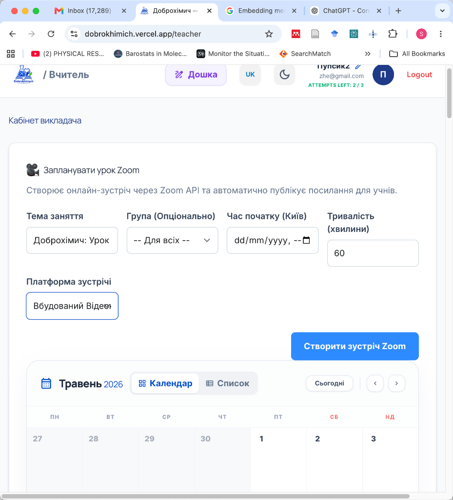
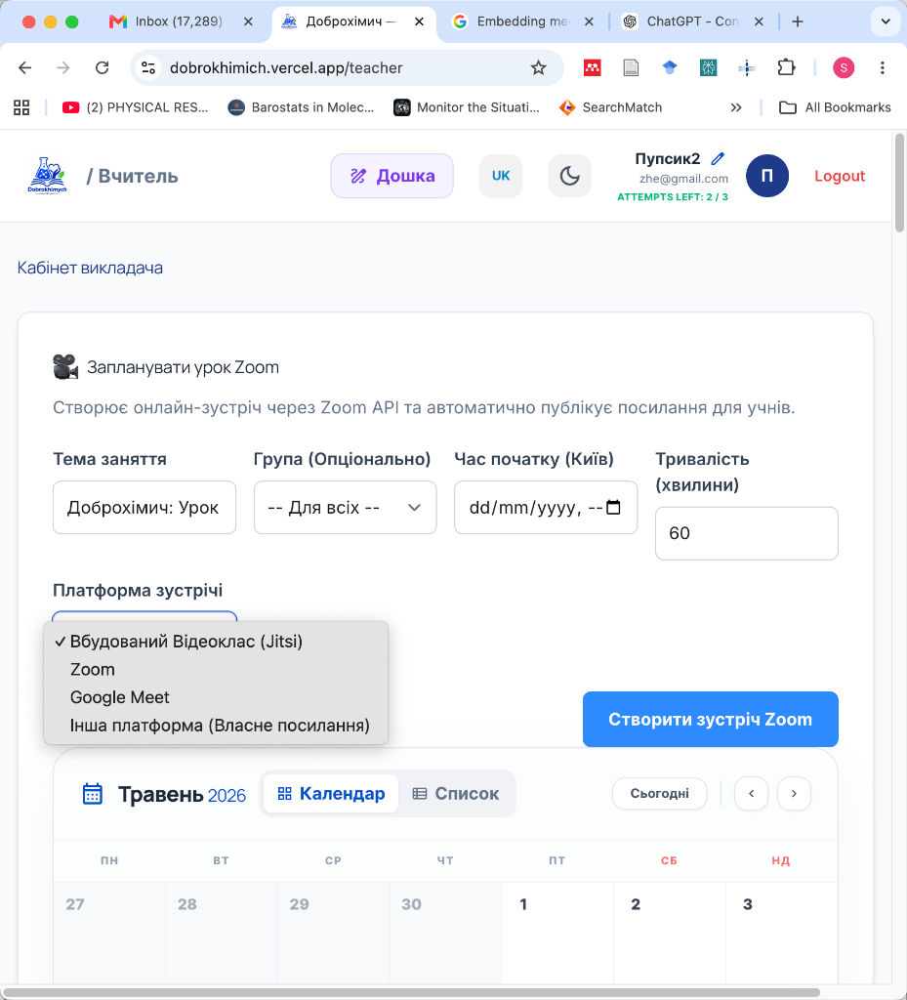

# Dobrokhimych LMS — Full-Stack Learning Management System

> **Curated code excerpts** from a production-grade Learning Management System built for a Ukrainian social education initiative providing free online Chemistry & Biology classes.

---

## 📸 Platform Screenshots

<p align="center">
  
  <br />
  <em>Fig 1: Dynamic course builder dashboard with interactive learning blocks and integrated video materials.</em>
</p>

<p align="center">
  
  <br />
  <em>Fig 2: Interactive schedule view showing calendar events, time-synchronized lessons, and Zoom API endpoints.</em>
</p>

---

## 🚀 Key Engineering Highlights

### 1. RLS Infinite Recursion Bypass (Express Proxy)
* **The Challenge:** Storing roles inside a `user_profiles` table referenced by Supabase Row-Level Security (RLS) policies caused infinite lookup loops.
* **The Solution:** A lightweight Node.js/Express server that validates client JWTs and uses the administrative **Service Role Key** (stored securely on the server) to execute restricted CRUD operations, successfully bypassing recursion while maintaining strict client-side RLS policies for non-admin queries.

```sql
-- The problematic loop: SELECT triggers policy → policy triggers SELECT
CREATE POLICY "admin_read" ON user_profiles FOR SELECT 
  USING ((SELECT role FROM user_profiles WHERE id = auth.uid()) = 'admin');
```

### 2. Embedded Video Call Suite (Jitsi Integration)
* **The Highlight:** A secure, zero-installation video call environment embedded directly within the application using Jitsi Meet API.
* **The Technical Detail:** Dynamically provisions password-protected rooms for course sections, preventing unauthorized access. Provides full teacher moderation capabilities and real-time room creation without external software dependencies.

### 3. Interactive Collaborative Whiteboard
* **The Highlight:** A real-time whiteboard canvas integrated under learning blocks, allowing teachers and students to draw, annotate, and collaborate during live calls.
* **The Technical Detail:** Built using HTML5 Canvas with state persistence and drawing synchronization, providing teachers with custom brush sizes, color palettes, and clear controls for interactive lecture styling.

### 4. Real-Time Video Sync Player (Supabase Broadcast)
* **The Highlight:** A shared class player utilizing **Supabase Realtime Broadcast channels** to synchronize video states across hundreds of students simultaneously.
* **The Technical Detail:** Implemented strict state reference checks (`useRef`) to decouple YouTube player events from incoming network broadcasts, successfully avoiding event cascade loops and desynchronization. Includes a background click-blocker layer for student clients to prevent manual navigation.

### 5. Dynamic Zoom S2S OAuth Integration
* **The Highlight:** Direct Server-to-Server OAuth integration for automatic video class lifecycle management (create, update, delete meetings).
* **The Technical Detail:** Implemented a zero-migration link storage strategy: both the `join_url` (for attendees) and `start_url` (for the host, containing credentials) are stored as serialized JSON inside a single database column. The frontend dynamically routes teachers/admins to the host URL and students to the participant URL on-click.

### 6. Enforcing Tamper-Proof Business Rules
* **The Highlight:** Restricting display name changes to exactly three per user (to prevent spoofing/spamming).
* **The Technical Detail:** Enforced this state strictly in Supabase `app_metadata`. Since browser-based clients cannot write to `app_metadata`, this implementation is 100% tamper-proof against frontend injection or client-side SDK manipulation.

---

## 📁 Selected Files in This Excerpt

| File | Core Technical Demonstration |
| :--- | :--- |
| [`backend/server_proxy.js`](./backend/server_proxy.js) | Express server with JWT validation, Supabase Admin operations, rate limiting, and Zoom OAuth S2S. |
| [`frontend/components/ScheduleView.tsx`](./frontend/components/ScheduleView.tsx) | Clean React scheduler resolving and launching host vs attendee links dynamically. |
| [`frontend/components/SyncYouTubePlayer.tsx`](./frontend/components/SyncYouTubePlayer.tsx) | Real-time state synchronization with loop-prevention references. |
| [`frontend/contexts/AuthContext.tsx`](./frontend/contexts/AuthContext.tsx) | React Context managing active auth sessions and server-side role resolution. |
| [`frontend/types/types.ts`](./frontend/types/types.ts) | TypeScript interfaces ensuring complete type safety for the platform data model. |

---

## 🛠️ Tech Stack

* **Frontend:** React 19, TypeScript, Vite, React Router, TailwindCSS/Vanilla CSS, YouTube IFrame API, Canvas API
* **Backend:** Node.js, Express, Supabase JS Admin SDK, Axios, Nodemailer, Express Rate Limit, Jitsi IFrame API
* **Database & BaaS:** PostgreSQL (with RLS), Supabase Auth, Storage, and Realtime Engine
